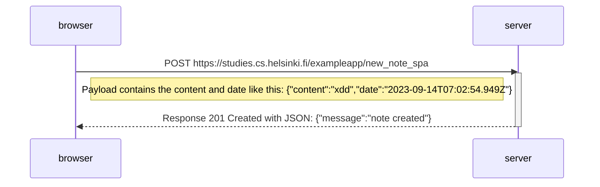

Part 0.5:

```mermaid
sequenceDiagram
    participant browser
    participant server

    browser->>server: POST https://studies.cs.helsinki.fi/exampleapp/new_note_spa
    activate server
            Note right of browser: Payload contains the content and date like this: {"content":"xdd","date":"2023-09-14T07:02:54.949Z"}
    server-->>browser: Response 201 Created with JSON: {"message":"note created"}
    deactivate server


```